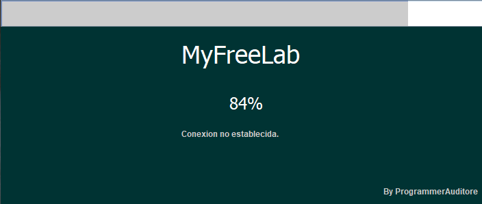
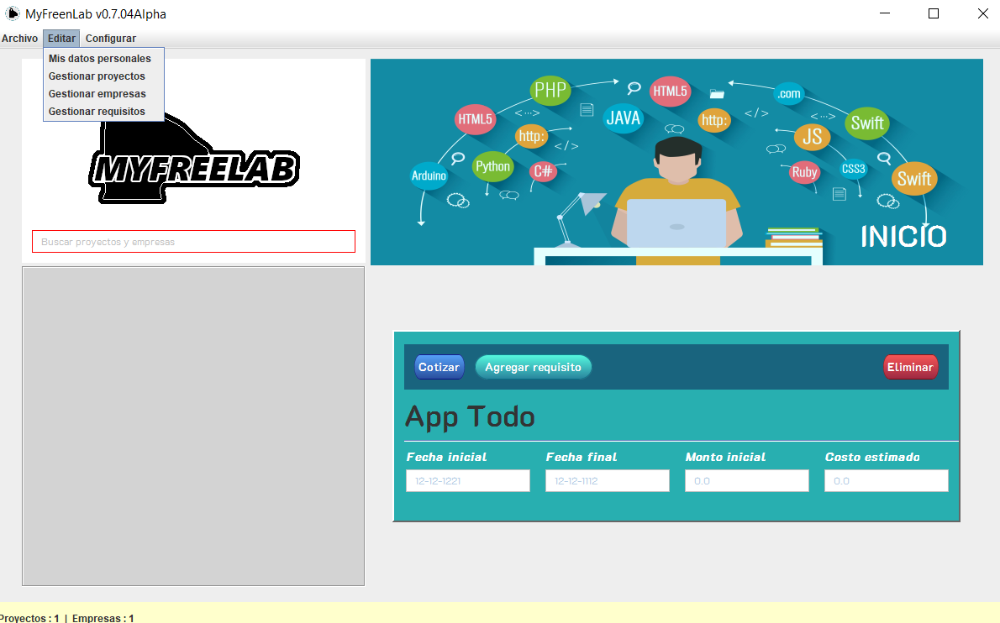

# MyFreeLab

MyFreeLab es un software libre para administrar o gestionar proyectos realizados y a realizar que permite generar reportes y avances de los proyectos.

La funcionalidades más importantes del software, son los siguiente: 
+ __Gestionar proyectos__. Está funcionalidad permite crear un proyecto. Permite ingresar los requisitos del proyecto, el nombre del proyecto, la fecha inicial, la fecha de entrega, un monto de importe, el monto total del proyecto y agregar para quien será el proyecto (la empresa). Todos estos datos introducidos se utilizaran para generar una cotización para la empresa (cliente). 
+ __Gestionar empresas__. Está funcionalidad permite crear una empresa, es decir, un cliente para el freelancer. Permite ingresar los datos de la empresa como nombre, nombre institución/empresa, dirección, correo electrónico, teléfono. Todos estos datos introducidos se utilizaran vincular o relacionar a un proyecto.
+ __Gestionar requisitos__. Está funcionalidad permite agregar requisitos, es decir, el proyecto a desarrollar. Permite ingresar los datos del requisito como nombre, coste. Todos estos datos introducidos se utilizaran vincular o relacionar a un proyecto. 
- (*)Vinculación.  Este funcionalidad permite vincular un proyecto con una empresa. 
- (*)Generar reportes.  Este funcionalidad como su nombre lo indica genera un reporte de ingresos y egreso total de todos los proyectos realizados. 
- (*)Generar cotizaciones. Esta funcionalidad como su nombre lo indica genera una cotización, para ello se necesita crear un proyecto, con todos los requisitos.

## Screenshot

___

___

___

___

## Requisitos
Los requisitos adicionales para el buen funcionamiento y rendimiento del software es descargar e instalar la librerías de Java (JDK y JRE). Esto se puede descargar desde la página oficial de Oracle.
